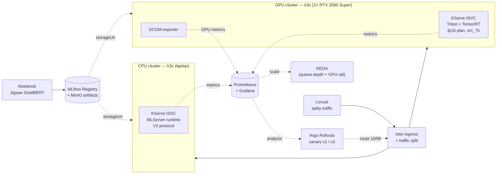

# basic_mlops_pipeline

A reproducible MLOps platform demo: train a text-toxicity classifier, register
it in MLflow, deploy through KServe with progressive delivery (Argo Rollouts),
and observe scale-to-zero and GPU-aware autoscaling — across two Kubernetes
clusters running identical application manifests on very different hardware.

The model is intentionally trivial (DistilBERT on Jigsaw). The interesting work
is the **platform**: how a trained artifact moves from a notebook into a
production-grade serving topology with progressive delivery, autoscaling on the
right signals, and a CPU-vs-GPU performance comparison.

## Architecture



Both clusters run the same platform stack (Istio, KServe, KEDA, Argo Rollouts,
Prometheus, MLflow) via a single shared install script. Only the runtime
(MLServer vs Triton+TensorRT), the node selector, and the autoscaler metric
source differ.

## Two acts

| | Act 1 — CPU (laptop) | Act 2 — GPU (workstation) |
|---|---|---|
| Cluster | `mlops-cpu` (k3s on laptop) | `mlops-gpu` (k3s on bare metal) |
| Runtime | MLServer via `mlflow://` storageUri | NVIDIA Triton with TensorRT plan |
| Handoff story | MLflow artifact → live prediction | ONNX → `trtexec` → TRT plan → Triton |
| Autoscaler signal | Request concurrency | Triton queue depth + DCGM GPU util |
| Headline demo | MLflow→prod handoff, canary | GPU cost optimization, perf engineering |

See [ADR 0002](docs/adr/0002-use-k3s-for-both-clusters.md) for the unified
runtime rationale (supersedes [ADR 0001](docs/adr/0001-use-kind-for-cpu-and-k3s-for-gpu.md)
after M0 verification surfaced kind-specific issues).

## Tech stack

| Layer | Choice | Why |
|---|---|---|
| Orchestration | k3s (both clusters) | Same runtime in dev and prod-like envs |
| Model serving | KServe (RawDeployment mode) | De-facto standard CRD; portable |
| CPU runtime | MLServer | Native MLflow `storageUri` handoff |
| GPU runtime | NVIDIA Triton + TensorRT | First-class TRT backend in KServe |
| Experiment tracking | MLflow + MinIO | Artifact + param/metric registry |
| Autoscaling | KEDA | RawDeployment-only; scales on Prometheus |
| Progressive delivery | Argo Rollouts | Canary with Prometheus `AnalysisTemplate` |
| Service mesh | Istio minimal | Traffic split for Argo Rollouts |
| Observability | kube-prometheus-stack | Prometheus + Grafana + operator |
| GPU metrics | NVIDIA DCGM exporter | Per-pod `DCGM_FI_DEV_GPU_UTIL` etc. |

## Repository layout

```
.
├── README.md
├── docs/adr/
│   ├── 0001-use-kind-for-cpu-and-k3s-for-gpu.md   superseded by 0002
│   └── 0002-use-k3s-for-both-clusters.md          current runtime decision
└── infra/
    ├── k3s-install.sh                              shared installer (WITH_GPU flag)
    ├── install-platform-stack.sh                   shared KServe/KEDA/Argo/Istio/Prometheus/MLflow
    ├── manifests/
    │   └── mlflow.yaml                             MLflow deployment (SQLite + MinIO S3)
    ├── scripts/
    │   └── harden-against-vpn-dns.sh               one-time host fix for NordVPN + k3s
    ├── cpu-cluster/
    │   └── bootstrap.sh                            sources shared k3s (no GPU) + platform stack
    └── gpu-cluster/
        ├── bootstrap.sh                            sources shared k3s (GPU) + GPU Operator + platform stack
        └── gpu-operator-values.yaml                device plugin + DCGM, host driver
```

Not yet scaffolded: `traffic/` (Locust + Argo Rollouts),
`monitoring/` (Grafana dashboards).

## Milestones

| ID | Milestone | Status |
|---|---|---|
| M0 | Cluster bootstrap + platform stack | **Verified on k3s** (CPU cluster); GPU cluster pending hardware. *Caveat:* initial M0 verification covered pod readiness only — a latent MLflow artifact-upload bug (missing `boto3` in the upstream image) was caught and fixed during M1 (see [ADR 0006](docs/adr/0006-use-distilbert-over-bert.md) refs + `infra/manifests/mlflow.yaml` comment). |
| M1 | Train DistilBERT on Jigsaw, log to MLflow | **Verified on CPU** (run `4927d59563184da6a5861765de043394`, auroc_macro 0.9795). See [ADR 0006](docs/adr/0006-use-distilbert-over-bert.md). |
| M2 | Serve v1 via KServe | **Verified on CPU** (MLServer + MLflow handoff; ISVC `toxicity-cpu` reaches Ready, V2 inference through Istio Gateway works end-to-end). GPU scaffolded (Triton + TRT); GPU cluster pending hardware. |
| M3 | Traffic sim + observe scale-to-zero | Not started |
| M4 | Argo Rollouts canary with Prometheus analysis | Not started |
| M5 | v2 retrain + automated promotion | Not started |

Stretch goals (one-line each, in `docs/adr/` as they become decisions):

- KServe transformer container — raw text → tokens → predictor
- GitHub Actions CI — retrain on PR, bake per-arch TRT engine matrix
- Grafana dashboard comparing CPU vs GPU latency / throughput / cost-per-1M-reqs
- Terraform overlay deploying the same manifests to a managed cloud cluster
- Model drift detection via KServe + alibi-detect

## Quickstart

### Prerequisites

On both machines: `kubectl`, `helm`, `jq`, `curl`, and sudo.
On the GPU workstation additionally: NVIDIA driver installed (`nvidia-smi`
works), Ubuntu/Debian for the nvidia-container-toolkit apt stanza.

**Host DNS caveat (k3s + NordVPN):** NordVPN's client overwrites
`/run/systemd/resolve/resolv.conf` when connected, pushing Nord's DNS servers
(which are reachable only via the tunnel). k3s's kubelet reads that file for
upstream resolvers, and pod-originated traffic isn't steered through the
NordLynx tunnel (fwmark-based policy routing only catches host traffic), so
CoreDNS upstream queries time out and cluster DNS breaks. Disconnecting the
VPN doesn't fix it until CoreDNS is restarted (it snapshots resolv.conf at
pod start). The fix is one-time host hardening:

```
sudo ./infra/scripts/harden-against-vpn-dns.sh
```

Gives k3s its own static resolv.conf that the VPN can't touch. Idempotent.
Run on any k3s host that also runs NordVPN / Tailscale MagicDNS / similar.
Same caveat applies in weaker form to the GPU workstation if it shares the
host network with a VPN client.

**Second failure mode (verified 2026-07-13):** NordVPN's *firewall* drops
bridge-forwarded pod↔pod traffic on `cni0` (iptables FORWARD via
br_netfilter) — even while the VPN is **disconnected**, because Meshnet
keeps the ruleset loaded. Symptom: pod→CoreDNS times out while pod→host and
pod→internet work fine (istio-ingress stuck unready on
`lookup istiod.istio-system.svc: i/o timeout` was the tell). The
`nordvpn allowlist` subnets do **not** help; they only cover host
INPUT/OUTPUT. The harden script now disables the NordVPN firewall
(`nordvpn set firewall off`) — the kill switch is a separate setting and is
left alone.

### CPU cluster (laptop, ~16 GB RAM)

```
sudo -E ./infra/cpu-cluster/bootstrap.sh
```

Installs k3s (disable Traefik, keep ServiceLB for LoadBalancer Services) and
the shared platform stack. MLflow UI reachable via
`kubectl -n mlflow port-forward svc/mlflow 5000`.

### GPU cluster (workstation)

One command on the bare-metal host:

```
sudo -E ./infra/gpu-cluster/bootstrap.sh
```

Does host prep (nvidia-container-toolkit + containerd config), installs k3s,
the GPU Operator (device plugin + DCGM exporter), runs an `nvidia-smi` smoke
test from a pod, then installs the same platform stack as the CPU cluster.

### Deploy the Triton toxicity model (GPU cluster)

```
# 1. Bake the TensorRT plan on sm_75 (run on the workstation).
SEQ_LEN=128 MAX_BATCH=32 \
    ./serving/gpu/build-engine.sh

# 2. Create the model repository PVC.
kubectl apply -f serving/gpu/model-pvc.yaml

# 3. Copy the baked repository into the PVC.
kubectl cp model-repo/distilbert-toxicity \
    default/<pvc-holder-pod>:/mnt/models/

# 4. Deploy the ISVC, ServiceMonitor, and query.
kubectl apply -f serving/gpu/inferenceservice-triton.yaml
kubectl apply -f serving/gpu/triton-servicemonitor.yaml
./serving/gpu/query.sh
```

## Inference contract

The Triton predictor currently takes pre-tokenized input. Once the KServe
transformer lands, raw text becomes the API contract.

```
POST /v2/models/distilbert-toxicity/infer
{
  "inputs": [
    {"name": "input_ids",      "shape": [1, 128], "datatype": "INT64", "data": [...]},
    {"name": "attention_mask", "shape": [1, 128], "datatype": "INT64", "data": [...]}
  ]
}
→ {"outputs": [{"name": "logits", "shape": [1, 6], "datatype": "FP32", "data": [...]}]}
```

Six logits correspond to the Jigsaw multi-label set: `toxic`,
`severe_toxic`, `obscene`, `threat`, `insult`, `identity_hate` (sigmoid, not
softmax — they are not mutually exclusive).

## Decisions

Architecture Decision Records live in [`docs/adr/`](docs/adr/). The point of
keeping them is to document engineering tradeoffs, not to ratify outputs:

- [0001 — kind for CPU, k3s for GPU](docs/adr/0001-use-kind-for-cpu-and-k3s-for-gpu.md) — **superseded**
- [0002 — k3s for both clusters](docs/adr/0002-use-k3s-for-both-clusters.md) — current
- [0006 — DistilBERT over full BERT](docs/adr/0006-use-distilbert-over-bert.md) — filed (M1)

Planned ADRs (filed when the corresponding code lands):

- 0003 — RawDeployment + KEDA over Serverless (Knative/Argo traffic-split conflict)
- 0004 — MLServer for the MLflow handoff on CPU
- 0005 — Triton TensorRT backend over ONNX-RT TensorRT EP on GPU
- 0007 — Per-architecture TRT engine matrix in CI

## Known limitations

- **Engine plans are GPU-architecture-bound.** A plan baked on sm_75 (Turing)
  will not run on the CPU cluster (no GPU) or on any other arch. Per-arch
  engine builds in CI are tracked as ADR 0007.
- **No text-in transformer yet.** Tokenization happens client-side in
  `serving/gpu/query.sh` until the KServe transformer container lands.
- **Single-node GPU cluster.** Max replicas is 2 (one pod per GPU). MPS or
  device-plugin time-slicing would unlock more; out of scope for v1.
- **Pinned versions are placeholders.** Helm chart versions in
  `infra/install-platform-stack.sh` and the MLflow chart values especially
  should be verified against upstream before relying on them. Flagged inline
  with `TODO`.
- **MLflow upstream image ships without `boto3`.** The
  `ghcr.io/mlflow/mlflow:v2.20.3` image does not include `boto3`, so the
  in-server artifact proxy (enabled by `--serve-artifacts`) 500s on every
  artifact PUT — `ModuleNotFoundError: No module named 'boto3'` in the pod
  logs. This was a latent bug from M0: the original "Verified on k3s" claim
  only checked pod readiness, not artifact uploads. Surfaced and fixed during
  M1 (2026-07-13) by wrapping the container command in
  `pip install --quiet boto3 && exec mlflow …`
  in `infra/manifests/mlflow.yaml`. Long-term fix: bake a custom image once a
  private registry is in place (ADR candidate).
- **KServe RawDeployment creates Ingress, not VirtualService.** In the
  current install (KServe v0.19 + Istio 1.30 via `helm install
  istio-ingress istio/gateway`), the auto-generated `networking.k8s.io/
  Ingress` for an ISVC is *not* picked up by the istio-ingress proxy,
  which serves Gateway CRD resources only. Symptom: `Ready=True`,
  `model=Loaded`, but every request through the Gateway returns 404.
  Workaround: each ISVC manifest ships a companion `VirtualService`
  in the same YAML (see `serving/cpu/inferenceservice-mlserver.yaml`
  for the pattern). Long-term fixes worth considering: enabling
  Istio's Kubernetes Ingress support, flipping KServe to
  `enableGatewayApi: true`, or wiring Knative back in.
- **PromQL labels need verification** against the actual DCGM exporter version.
  See comments in `serving/gpu/inferenceservice-triton.yaml`.
