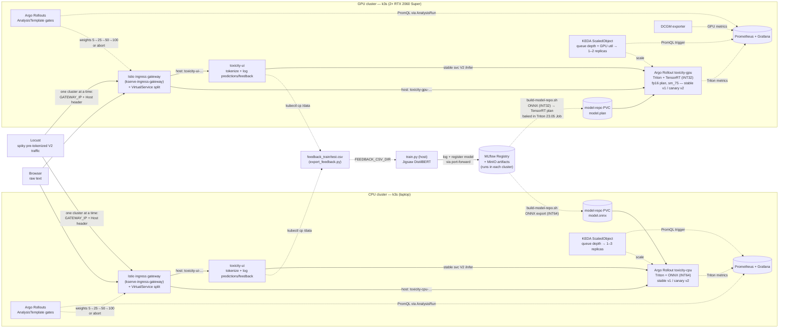

# progressive_model_delivery

A **reference implementation** of a production serving topology for ML: train a
text-toxicity classifier, register it in MLflow, deploy through KServe with
progressive delivery (Argo Rollouts), and observe scale-to-zero and GPU-aware
autoscaling — across two Kubernetes clusters running identical application
manifests on very different hardware.

## What this is

**Production topology, not production operations.**

The architecture is the one you would actually run: Istio ingress, canary
weights gated on live PromQL analysis rather than a timer, autoscaling driven by
Triton queue depth and DCGM GPU utilization, artifacts moving through a registry
instead of a `scp`. Every step is a script or a manifest — bootstrap, deploy,
query, canary, promote, and roll back are all runnable commands, and none of it
is click-ops.

The operational envelope around that topology is deliberately out of scope:
single-node clusters, no HA, no SLOs, no on-call, no CI, no multi-tenancy, and
no real users. Those are not oversights to be discovered — they are the scope
line, and where it bites is written down in
[Known limitations](#known-limitations).

The distinction that matters for a reader: everything here has been *run*, on
two very different machines, and the failures that took real debugging (silent
DNS hijacking, a serving image missing `boto3`, KServe's Ingress never reaching
the Istio proxy) are documented as findings rather than smoothed over.

## Motivation

Most MLOps tutorials stop at "model in a notebook, Dockerfile around it". The
hard part is everything after: how a trained artifact moves from a training
run into a real serving topology, how a new model version earns its way into
production, and what it costs to serve.

This project exists to make that path concrete and reproducible:

- **The full loop, not a slice.** Train → register in MLflow → export
  (ONNX / TensorRT) → serve behind an Istio gateway → canary the next version
  with Prometheus analysis gates → promote or roll back. Plus a web UI whose
  "disagree" labels feed back into training data.
- **The model is intentionally trivial** (DistilBERT on Jigsaw). The
  interesting work is the **platform** — the model can be swapped for anything
  without changing the machinery around it.
- **Same manifests, different hardware.** A laptop CPU cluster and a
  bare-metal 2×GPU cluster run identical application manifests, so CPU-vs-GPU
  serving cost and autoscaling behavior can be compared honestly.
- **Everything is a script or a manifest.** No console click-ops: bootstrap,
  deploy, query, canary, promote, and roll back are all runnable commands.

## Architecture



Both clusters run the same platform stack (Istio, KServe, KEDA, Argo Rollouts,
Prometheus, MLflow) via a single shared install script. Only the Triton
backend (ONNX on CPU vs TensorRT on GPU), the node selector, and the DCGM
autoscaler trigger differ.

## Two acts

| | Act 1 — CPU (laptop) | Act 2 — GPU (workstation) |
|---|---|---|
| Cluster | `mlops-cpu` (k3s on laptop) | `mlops-gpu` (k3s on bare metal) |
| Runtime | Triton + ONNX backend (`model.onnx`) | Triton + TensorRT backend (`model.plan`) |
| Handoff story | MLflow → ONNX export → PVC → Triton | MLflow → ONNX → TensorRT plan → Triton |
| Autoscaler signal | Triton queue depth | Triton queue depth + DCGM GPU util |
| Headline result | Autoscaling, Argo Rollouts canary | GPU cost optimization, autoscaling, canary |

Both clusters use k3s as the runtime — one install path, identical manifests,
very different hardware.

## Tech stack

| Layer | Choice | Why |
|---|---|---|
| Orchestration | k3s (both clusters) | Same runtime in dev and prod-like envs |
| Model serving | KServe (RawDeployment mode) | De-facto standard CRD; portable |
| Inference runtime | NVIDIA Triton (both clusters) | One runtime, one config format |
| CPU backend | ONNX Runtime (via Triton) | Runtime-agnostic; no version mismatch |
| GPU backend | TensorRT (via Triton) | First-class TRT backend in KServe |
| Experiment tracking | MLflow + MinIO | Artifact + param/metric registry |
| Autoscaling | KEDA | RawDeployment-only; scales on Prometheus |
| Progressive delivery | Argo Rollouts | Canary with Prometheus `AnalysisTemplate` |
| Service mesh | Istio minimal | Traffic split for Argo Rollouts |
| Observability | kube-prometheus-stack | Prometheus + Grafana + operator |
| GPU metrics | NVIDIA DCGM exporter | Per-pod `DCGM_FI_DEV_GPU_UTIL` etc. |

## Repository layout

```
.
├── README.md
├── infra/
│   ├── k3s-install.sh                              shared installer (WITH_GPU flag)
│   ├── install-platform-stack.sh                   shared KServe/KEDA/Argo/Istio/Prometheus/MLflow
│   ├── manifests/
│   │   └── mlflow.yaml                             MLflow deployment (SQLite + MinIO S3)
│   ├── scripts/
│   │   └── harden-against-vpn-dns.sh               one-time host fix for NordVPN + k3s
│   ├── cpu-cluster/
│   │   └── bootstrap.sh                            sources shared k3s (no GPU) + platform stack
│   └── gpu-cluster/
│       ├── bootstrap.sh                            sources shared k3s (GPU) + GPU Operator + platform stack
│       └── gpu-operator-values.yaml                device plugin + DCGM, host driver
├── serving/
│   ├── cpu/                                        Triton + ONNX predictor (Argo Rollout)
│   ├── cpu/canary/                                 canary artifacts
│   ├── gpu/                                        Triton + TensorRT predictor (Argo Rollout)
│   └── gpu/canary/                                 canary artifacts
├── traffic/                                        Locust load tests
├── frontend/                                       toxicity-ui: raw-text web UI + feedback logging
└── monitoring/                                     Grafana dashboards + Argo Rollouts metrics
```

`traffic/` holds the Locust load tests, `monitoring/` the Grafana dashboards,
and the canary/autoscaling plumbing lives in `serving/{cpu,gpu}/rollout.yaml`,
`serving/{cpu,gpu}/scaledobject.yaml`, and `serving/{cpu,gpu}/canary/`.

## Quick Start

### Prerequisites

On both machines: `kubectl`, `helm`, `jq`, `curl`, and sudo.
On the GPU workstation additionally: NVIDIA driver installed (`nvidia-smi`
works), Ubuntu/Debian for the nvidia-container-toolkit apt stanza.

**`training/` requires Python 3.12.** It pins `torch==2.5.1`, which publishes no
wheels above cp312, and `download.pytorch.org` prunes old releases from its
index — so a 3.13+ venv fails with "no matching distribution found for torch",
an error that names torch and never mentions the interpreter. `numpy==1.26.4`
and `pandas==2.1.4` share the ceiling. The version is pinned in
`training/.python-version`; create the venv explicitly:

```bash
cd training && ~/.pyenv/versions/3.12.13/bin/python -m venv .venv
.venv/bin/pip install -r requirements.txt
```

**Host DNS caveat (k3s + NordVPN):** NordVPN's client overwrites
`/run/systemd/resolve/resolv.conf` when connected, pushing Nord's DNS servers
(which are reachable only via the tunnel). k3s's kubelet reads that file for
upstream resolvers, and pod-originated traffic isn't steered through the
NordLynx tunnel (fwmark-based policy routing only catches host traffic), so
CoreDNS upstream queries time out and cluster DNS breaks. Disconnecting the
VPN doesn't fix it until CoreDNS is restarted (it snapshots resolv.conf at
pod start). The fix is one-time host hardening:

```
sudo ./infra/scripts/harden-against-vpn-dns.sh
```

Gives k3s its own static resolv.conf that the VPN can't touch. Idempotent.
Run on any k3s host that also runs NordVPN / Tailscale MagicDNS / similar.
Same caveat applies in weaker form to the GPU workstation if it shares the
host network with a VPN client.

**Second failure mode (verified 2026-07-13):** NordVPN's *firewall* drops
bridge-forwarded pod↔pod traffic on `cni0` (iptables FORWARD via
br_netfilter) — even while the VPN is **disconnected**, because Meshnet
keeps the ruleset loaded. Symptom: pod→CoreDNS times out while pod→host and
pod→internet work fine (istio-ingress stuck unready on
`lookup istiod.istio-system.svc: i/o timeout` was the tell). The
`nordvpn allowlist` subnets do **not** help; they only cover host
INPUT/OUTPUT. The harden script now disables the NordVPN firewall
(`nordvpn set firewall off`) — the kill switch is a separate setting and is
left alone.

### CPU cluster (laptop, ~16 GB RAM)

```
sudo -E ./infra/cpu-cluster/bootstrap.sh
```

Installs k3s (disable Traefik, keep ServiceLB for LoadBalancer Services) and
the shared platform stack. MLflow UI reachable via
`kubectl -n mlflow port-forward svc/mlflow 5000`.

### GPU cluster (workstation)

One command on the bare-metal host:

```
sudo -E ./infra/gpu-cluster/bootstrap.sh
```

Does host prep (nvidia-container-toolkit + containerd config), installs k3s,
the GPU Operator (device plugin + DCGM exporter), runs an `nvidia-smi` smoke
test from a pod, then installs the same platform stack as the CPU cluster.

### Deploy the Triton toxicity model (GPU cluster)

The GPU predictor is an Argo Rollout (not a KServe ISVC) so canary traffic
splitting works. The TensorRT plan is built inside the same Triton 23.05
container that serves it, avoiding host TensorRT version mismatches.

```bash
# 1. Train (or reuse a run from MLflow).
cd training
MLFLOW_REGISTER_MODEL=true MLFLOW_PROMOTE_MODEL=true \
  .venv/bin/python -m training.train
# Note the run_id, e.g. 715720fe79cb44178dfa65ef32da50eb

# 2. Build the v1 TensorRT plan into the model PVC.
MLFLOW_RUN_ID=715720fe79cb44178dfa65ef32da50eb \
  ./serving/gpu/build-model-repo.sh

# 3. Deploy the GPU predictor, autoscaling, and canary analysis gates.
kubectl apply -f serving/gpu/rollout.yaml
kubectl apply -f serving/gpu/scaledobject.yaml
kubectl apply -f serving/gpu/analysis-template.yaml
kubectl apply -f serving/gpu/triton-servicemonitor.yaml

# 4. Query.
./serving/gpu/query.sh
```

`build-model-repo.sh` exports ONNX with INT32 inputs (TensorRT requires INT32;
the CPU path keeps INT64) and runs a Kubernetes Job using the Triton 23.05
image to bake the `.plan` engine. If you prefer to bake on the host, see
`serving/gpu/build-engine.sh`, but the host `trtexec` must match the TensorRT
version inside Triton 23.05 (TensorRT 8.6).

## Usage

Once a cluster is up and the model is deployed, the day-to-day surfaces are:

**Classify text.** Easiest is the web UI (see
[Toxicity UI + feedback loop](#toxicity-ui--feedback-loop)); the API is plain
JSON:

```bash
GATEWAY_IP=$(kubectl -n istio-ingress get svc istio-ingress -o jsonpath='{.status.loadBalancer.ingress[0].ip}')
curl -H "Host: toxicity-ui-default.example.com" -H "Content-Type: application/json" \
  -d '{"text":"you are a wonderful person"}' "http://$GATEWAY_IP/api/predict"
# → {"id": "…", "scores": {"toxic": 0.01, …}}
```

Or smoke-test Triton directly (pre-tokenized V2 protocol — see
[Inference contract](#inference-contract)):

```bash
./serving/cpu/query.sh      # or serving/gpu/query.sh
SAMPLE_TEXT="i hate this" ./serving/cpu/query.sh
```

**Track experiments.** MLflow UI:
`kubectl -n mlflow port-forward svc/mlflow 5000` → http://localhost:5000.
Training runs log params, metrics, the model artifact, and a `manifest.json`
describing the label contract.

**Watch it scale and roll.** Grafana:
`kubectl -n observability port-forward svc/kube-prometheus-stack-grafana 3000:80`
(admin/admin) — dashboards for autoscaling and canary analysis. Generate load
with `traffic/run.sh` (Locust) and watch KEDA scale the rollout on Triton
queue depth.

**Ship a new model.** Retrain with the promotion gate, then run the canary —
see [Canary with Argo Rollouts](#canary-with-argo-rollouts) and
[Automated v2 retrain and promotion](#automated-v2-retrain-and-promotion).
Roll back with `./serving/{cpu,gpu}/rollback.sh`.

**Feed real corrections back in.** Predictions and user "disagree" labels are
logged by the UI; export and retrain on them:

```bash
POD=$(kubectl get pod -l app=toxicity-ui -o jsonpath='{.items[0].metadata.name}')
kubectl cp "default/$POD:/data" ./data
python3 frontend/export_feedback.py --data-dir ./data
cd training && FEEDBACK_CSV_DIR=$PWD/../data MLFLOW_REGISTER_MODEL=true \
  MLFLOW_PROMOTE_MODEL=true .venv/bin/python -m training.train
```

## Canary with Argo Rollouts

Both CPU and GPU predictors are Argo Rollouts so Istio traffic-split canaries
can run with Prometheus analysis gates. Replace `cpu` with `gpu` below for the
GPU cluster.

```bash
# 1. Build the v1 model repo and deploy the stable Rollout.
./serving/cpu/build-model-repo.sh
kubectl apply -f serving/cpu/rollout.yaml
kubectl apply -f serving/cpu/scaledobject.yaml
kubectl apply -f serving/cpu/triton-servicemonitor.yaml
kubectl apply -f serving/cpu/analysis-template.yaml

# 2. Enable Argo Rollouts controller metrics for the canary dashboard.
kubectl apply -f monitoring/argo-rollouts-metrics.yaml
kubectl apply -f monitoring/dashboards/k8s-configmap-m4.yaml

# 3. Verify stable inference.
./serving/cpu/query.sh

# 4. Build the placeholder v2 repo and start the canary.
./serving/cpu/canary/build-canary-placeholder.sh
kubectl apply -f serving/cpu/canary/rollout-v2.yaml

# 5. Watch the rollout shift traffic 5% -> 25% -> 50% -> 100%.
# Requires the kubectl argo rollouts plugin:
#   https://argo-rollouts.readthedocs.io/en/stable/installation/#kubectl-plugin-installation
kubectl argo rollouts get rollout toxicity-cpu --watch

# Fallback without the plugin:
kubectl get rollout toxicity-cpu -w
```

GPU-specific notes:
- Use `setCanaryScale: 1` (configured in `serving/gpu/rollout.yaml`) on a
  single-node 2-GPU cluster so stable + canary fit on the node. The wrapper
  script `serving/gpu/canary/run-canary.sh` pauses KEDA at 1 replica during
  the canary to avoid HPA conflicts, then resumes autoscaling after promotion.
- Triton metrics are filtered by `version="2"`; the canary config pins that
  version in `serving/gpu/canary/build-canary-placeholder.sh`.

See `serving/cpu/canary/README.md` and `serving/gpu/canary/` for details and
`monitoring/README.md` for the canary dashboard.

## Automated v2 retrain and promotion

This flow closes the loop from a new training run to a promoted model.
Replace `cpu` with `gpu` below for the GPU cluster.

```bash
# 1. Retrain with the promotion gate enabled.
#    Requires MLflow port-forward and Kaggle token.
cd training
MLFLOW_REGISTER_MODEL=true MLFLOW_PROMOTE_MODEL=true \
  .venv/bin/python -m training.train

# 2. Note the new run_id from the output.

# 3. Validate, build canary v2, deploy, and optionally promote.
./serving/cpu/canary/promote-and-canary.sh <run-id> --promote
```

If the canary fails, roll back to stable v1:

```bash
./serving/cpu/rollback.sh
```

GPU-specific notes:
- `serving/gpu/canary/promote-and-canary.sh` exports ONNX with INT32 inputs,
  bakes a TensorRT plan inside the Triton 23.05 container, and runs the same
  Argo Rollouts canary as the CPU path.
- After promotion the canary model repo is copied to the stable PVC and the
  Rollout is pointed back at the stable PVC.

See `serving/{cpu,gpu}/canary/README.md` for details on the canary step.

## Toxicity UI + feedback loop

`frontend/` is a small FastAPI service + web page that accepts raw text (it
does the tokenization Triton doesn't), returns per-label toxicity scores, and
logs every input with a UUID. Users who disagree can submit their own labels,
which are logged too; `frontend/export_feedback.py` joins the two logs and
splits them into Jigsaw-schema `feedback_train.csv` / `feedback_test.csv`,
which training appends to the Jigsaw split when `FEEDBACK_CSV_DIR` is set —
the promotion gate and canary pipeline are unchanged.

```bash
docker build -t toxicity-ui:latest frontend/
docker save toxicity-ui:latest | sudo k3s ctr images import -
kubectl apply -f frontend/k8s.yaml
# UI + API at host toxicity-ui-default.example.com on the same Istio gateway
```

See `frontend/README.md` for the full build/deploy/feedback-loop walkthrough.

## Inference contract

The Triton predictor currently takes pre-tokenized input. Once the KServe
transformer lands, raw text becomes the API contract.

CPU predictor (`serving/cpu/query.sh`):
```
POST /v2/models/distilbert-toxicity/infer
{
  "inputs": [
    {"name": "input_ids",      "shape": [1, 128], "datatype": "INT64", "data": [...]},
    {"name": "attention_mask", "shape": [1, 128], "datatype": "INT64", "data": [...]}
  ]
}
→ {"outputs": [{"name": "logits", "shape": [1, 6], "datatype": "FP32", "data": [...]}]}
```

GPU predictor (`serving/gpu/query.sh`): TensorRT does not support INT64 inputs,
so `input_ids` and `attention_mask` use `INT32`. The ONNX export wraps the
model to cast INT32 inputs to INT64 before the embedding layer.

Six logits correspond to the Jigsaw multi-label set: `toxic`,
`severe_toxic`, `obscene`, `threat`, `insult`, `identity_hate` (sigmoid, not
softmax — they are not mutually exclusive).

## Known limitations

- **Engine plans are GPU-architecture-bound.** A plan baked on sm_75 (Turing)
  will not run on the CPU cluster (no GPU) or on any other arch. Per-arch
  engine builds in CI are a stretch goal.
- **TensorRT engine is built inside the serving container.** This avoids host
  TensorRT version skew but adds ~10 minutes to the first deploy while the
  Triton 23.05 image is pulled.
- **GPU canary needs KEDA paused on a 2-GPU node.** Argo Rollouts canary with
  `setCanaryScale: 1` plus KEDA/HPA wanting 2 replicas can leave a stable pod
  Pending on a single-node 2-GPU cluster. `serving/gpu/canary/run-canary.sh`
  pauses KEDA at 1 replica during the canary and resumes it after promotion.
- **No text-in transformer yet.** Tokenization happens client-side in
  `serving/{cpu,gpu}/query.sh` until the KServe transformer container lands.
- **Single-node GPU cluster.** Max replicas is 2 (one pod per GPU). MPS or
  device-plugin time-slicing would unlock more; out of scope for v1.
- **Pinned versions are placeholders.** Helm chart versions in
  `infra/install-platform-stack.sh` and the MLflow chart values especially
  should be verified against upstream before relying on them. Flagged inline
  with `TODO`.
- **MLflow upstream image ships without `boto3`.** The
  `ghcr.io/mlflow/mlflow:v2.20.3` image does not include `boto3`, so the
  in-server artifact proxy (enabled by `--serve-artifacts`) 500s on every
  artifact PUT — `ModuleNotFoundError: No module named 'boto3'` in the pod
  logs. Fixed by wrapping the container command in
  `pip install --quiet boto3 && exec mlflow …`
  in `infra/manifests/mlflow.yaml`. Long-term fix: bake a custom image once a
  private registry is in place.
- **KServe RawDeployment creates Ingress, not VirtualService.** In the
  current install (KServe v0.19 + Istio 1.30 via `helm install
  istio-ingress istio/gateway`), the auto-generated `networking.k8s.io/
  Ingress` for an ISVC is *not* picked up by the istio-ingress proxy,
  which serves Gateway CRD resources only. Symptom: `Ready=True`,
  `model=Loaded`, but every request through the Gateway returns 404.
  Both CPU and GPU predictors therefore use Argo Rollouts with their own
  Istio `VirtualService` (see `serving/cpu/rollout.yaml` and
  `serving/gpu/rollout.yaml`).
- **PromQL labels need verification** against the actual DCGM exporter version.
  See `serving/gpu/scaledobject.yaml`.
- **CPU predictor keeps one replica at idle.** True scale-to-zero is out of
  scope for RawDeployment. `minReplicas: 1` ensures the pod-level Triton
  metric used by KEDA is always available. If scale-to-zero becomes a hard
  requirement, the right path is Serverless (Knative) mode, not a
  RawDeployment workaround.

## Contributing

Contributions are welcome. The project is small enough that a few conventions
keep it coherent:

- **Everything runnable, nothing click-ops.** New functionality should land as
  a script or a manifest that can be applied with `kubectl apply` / executed
  directly — not as console instructions. Keep scripts idempotent and
  `set -euo pipefail`-clean, matching the existing `infra/` and `serving/`
  scripts.
- **Config via env vars.** Training (`training/src/env.py`) and the frontend
  (`frontend/app.py`) read all knobs from the environment, with
  `training/.env.example` documenting them. Add new knobs there, not as new
  CLI flags or hardcoded values.
- **Python code lives in per-area venvs.** Each area has its own
  `requirements.txt` and `.venv` (`training/`, `traffic/`, `frontend/`).
  Don't add a dependency without adding it to the relevant
  `requirements.txt`, and match the versions/idioms already in use.
- **Keep the label contract stable.** The six Jigsaw labels and their order
  (`toxic, severe_toxic, obscene, threat, insult, identity_hate`) are a
  cross-component contract — training, the Triton configs, the frontend, and
  the feedback exporter all depend on it. Changing it means changing all of
  them together.
- **Verify before claiming.** Run the thing you're changing end-to-end
  (train a short run, query the predictor, exercise the UI) and update the
  relevant README when behavior or commands change.

Suggested flow: open an issue describing the change before large work
(new platform components, changes to the promotion/canary flow), keep PRs
scoped to one concern, and include the commands you used to verify.
