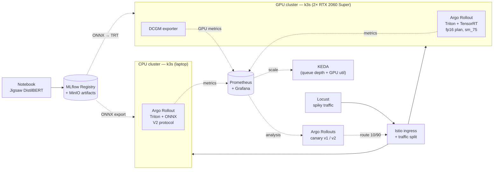

# basic_mlops_pipeline

A reproducible MLOps platform demo: train a text-toxicity classifier, register
it in MLflow, deploy through KServe with progressive delivery (Argo Rollouts),
and observe scale-to-zero and GPU-aware autoscaling — across two Kubernetes
clusters running identical application manifests on very different hardware.

The model is intentionally trivial (DistilBERT on Jigsaw). The interesting work
is the **platform**: how a trained artifact moves from a notebook into a
production-grade serving topology with progressive delivery, autoscaling on the
right signals, and a CPU-vs-GPU performance comparison.

## Architecture



Both clusters run the same platform stack (Istio, KServe, KEDA, Argo Rollouts,
Prometheus, MLflow) via a single shared install script. Only the Triton
backend (ONNX on CPU vs TensorRT on GPU), the node selector, and the DCGM
autoscaler trigger differ. See [ADR 0005](docs/adr/0005-use-triton-on-both-cpu-and-gpu.md).

## Two acts

| | Act 1 — CPU (laptop) | Act 2 — GPU (workstation) |
|---|---|---|
| Cluster | `mlops-cpu` (k3s on laptop) | `mlops-gpu` (k3s on bare metal) |
| Runtime | Triton + ONNX backend (`model.onnx`) | Triton + TensorRT backend (`model.plan`) |
| Handoff story | MLflow → ONNX export → PVC → Triton | MLflow → ONNX → TensorRT plan → Triton |
| Autoscaler signal | Triton queue depth | Triton queue depth + DCGM GPU util |
| Headline demo | Autoscaling, Argo Rollouts canary | GPU cost optimization, autoscaling, canary |

See [ADR 0002](docs/adr/0002-use-k3s-for-both-clusters.md) for the unified
runtime rationale (supersedes [ADR 0001](docs/adr/0001-use-kind-for-cpu-and-k3s-for-gpu.md)
after M0 verification surfaced kind-specific issues).

## Tech stack

| Layer | Choice | Why |
|---|---|---|
| Orchestration | k3s (both clusters) | Same runtime in dev and prod-like envs |
| Model serving | KServe (RawDeployment mode) | De-facto standard CRD; portable |
| Inference runtime | NVIDIA Triton (both clusters) | One runtime, one config format; see ADR 0005 |
| CPU backend | ONNX Runtime (via Triton) | Runtime-agnostic; no version mismatch |
| GPU backend | TensorRT (via Triton) | First-class TRT backend in KServe |
| Experiment tracking | MLflow + MinIO | Artifact + param/metric registry |
| Autoscaling | KEDA | RawDeployment-only; scales on Prometheus |
| Progressive delivery | Argo Rollouts | Canary with Prometheus `AnalysisTemplate` |
| Service mesh | Istio minimal | Traffic split for Argo Rollouts |
| Observability | kube-prometheus-stack | Prometheus + Grafana + operator |
| GPU metrics | NVIDIA DCGM exporter | Per-pod `DCGM_FI_DEV_GPU_UTIL` etc. |

## Repository layout

```
.
├── README.md
├── docs/adr/
│   ├── 0001-use-kind-for-cpu-and-k3s-for-gpu.md   superseded by 0002
│   └── 0002-use-k3s-for-both-clusters.md          current runtime decision
├── infra/
│   ├── k3s-install.sh                              shared installer (WITH_GPU flag)
│   ├── install-platform-stack.sh                   shared KServe/KEDA/Argo/Istio/Prometheus/MLflow
│   ├── manifests/
│   │   └── mlflow.yaml                             MLflow deployment (SQLite + MinIO S3)
│   ├── scripts/
│   │   └── harden-against-vpn-dns.sh               one-time host fix for NordVPN + k3s
│   ├── cpu-cluster/
│   │   └── bootstrap.sh                            sources shared k3s (no GPU) + platform stack
│   └── gpu-cluster/
│       ├── bootstrap.sh                            sources shared k3s (GPU) + GPU Operator + platform stack
│       └── gpu-operator-values.yaml                device plugin + DCGM, host driver
├── serving/
│   ├── cpu/                                        Triton + ONNX predictor (Argo Rollout from M4)
│   ├── cpu/canary/                                 M4 canary artifacts
│   ├── gpu/                                        Triton + TensorRT predictor (Argo Rollout from M4)
│   └── gpu/canary/                                 M4/M5 canary artifacts
├── traffic/                                        Locust load tests (M3)
└── monitoring/                                     Grafana dashboards + Argo Rollouts metrics
```

`traffic/` (Locust) is in place for M3, `monitoring/` has dashboards for M3
and M4, and M4/M5 plumbing is in `serving/{cpu,gpu}/rollout.yaml`,
`serving/{cpu,gpu}/scaledobject.yaml`, and `serving/{cpu,gpu}/canary/`.

## Milestones

| ID | Milestone | Status |
|---|---|---|
| M0 | Cluster bootstrap + platform stack | **Verified on k3s** (both CPU and GPU clusters). *Caveat:* initial M0 verification covered pod readiness only — a latent MLflow artifact-upload bug (missing `boto3` in the upstream image) was caught and fixed during M1 (see [ADR 0006](docs/adr/0006-use-distilbert-over-bert.md) refs + `infra/manifests/mlflow.yaml` comment). |
| M1 | Train DistilBERT on Jigsaw, log to MLflow | **Verified on CPU and GPU** (run `715720fe79cb44178dfa65ef32da50eb`, auroc_macro 0.9795). See [ADR 0006](docs/adr/0006-use-distilbert-over-bert.md). |
| M2 | Serve v1 | **Verified on CPU** (Triton + ONNX backend; Argo Rollout `toxicity-cpu`, V2 inference through Istio Gateway works end-to-end). **Verified on GPU** (Triton + TensorRT backend; Argo Rollout `toxicity-gpu`). See [ADR 0005](docs/adr/0005-use-triton-on-both-cpu-and-gpu.md). |
| M3 | Traffic sim + observe autoscaling | **Verified on CPU** — KEDA scaled `toxicity-cpu` from 1 → 3 replicas on Triton queue-duration and scaled back to 1 after traffic stopped. **Verified on GPU** — KEDA scaled `toxicity-gpu` from 1 → 2 replicas on Triton queue-depth. True scale-to-zero intentionally dropped; see [ADR 0007](docs/adr/0007-drop-scale-to-zero-keep-min-one-replica.md). Grafana M3 dashboard deployed. |
| M4 | Argo Rollouts canary with Prometheus analysis | **Verified on CPU** — placeholder v2 canary ran end-to-end through 5% → 25% → 50% → 100% with `setCanaryScale: 3`, all Prometheus analysis gates passed. **Verified on GPU** — placeholder v2 canary ran end-to-end through 5% → 25% → 50% → 100% with `setCanaryScale: 1` (2-GPU node limit), all Prometheus analysis gates passed. Grafana M4 dashboard deployed. See [ADR 0008](docs/adr/0008-argo-rollouts-canary-with-kserve-rawdeployment.md) and [ADR 0009](docs/adr/0009-placeholder-v2-artifact-for-m4.md). |
| M5 | v2 retrain + automated promotion | **Verified on CPU** — retrained model passed the AUROC gate, was staged in MLflow, built into a canary v2 repository, and promoted through the Argo Rollouts canary. **Verified on GPU** — same promotion pipeline builds a TensorRT plan in the canary PVC and promotes through the Argo Rollouts canary. See [ADR 0010](docs/adr/0010-automated-v2-retrain-and-promotion.md). |

Stretch goals (one-line each, in `docs/adr/` as they become decisions):

- KServe transformer container — raw text → tokens → predictor
- GitHub Actions CI — retrain on PR, bake per-arch TRT engine matrix
- Grafana dashboard comparing CPU vs GPU latency / throughput / cost-per-1M-reqs
- Terraform overlay deploying the same manifests to a managed cloud cluster
- Model drift detection via KServe + alibi-detect

## Quickstart

### Prerequisites

On both machines: `kubectl`, `helm`, `jq`, `curl`, and sudo.
On the GPU workstation additionally: NVIDIA driver installed (`nvidia-smi`
works), Ubuntu/Debian for the nvidia-container-toolkit apt stanza.

**Host DNS caveat (k3s + NordVPN):** NordVPN's client overwrites
`/run/systemd/resolve/resolv.conf` when connected, pushing Nord's DNS servers
(which are reachable only via the tunnel). k3s's kubelet reads that file for
upstream resolvers, and pod-originated traffic isn't steered through the
NordLynx tunnel (fwmark-based policy routing only catches host traffic), so
CoreDNS upstream queries time out and cluster DNS breaks. Disconnecting the
VPN doesn't fix it until CoreDNS is restarted (it snapshots resolv.conf at
pod start). The fix is one-time host hardening:

```
sudo ./infra/scripts/harden-against-vpn-dns.sh
```

Gives k3s its own static resolv.conf that the VPN can't touch. Idempotent.
Run on any k3s host that also runs NordVPN / Tailscale MagicDNS / similar.
Same caveat applies in weaker form to the GPU workstation if it shares the
host network with a VPN client.

**Second failure mode (verified 2026-07-13):** NordVPN's *firewall* drops
bridge-forwarded pod↔pod traffic on `cni0` (iptables FORWARD via
br_netfilter) — even while the VPN is **disconnected**, because Meshnet
keeps the ruleset loaded. Symptom: pod→CoreDNS times out while pod→host and
pod→internet work fine (istio-ingress stuck unready on
`lookup istiod.istio-system.svc: i/o timeout` was the tell). The
`nordvpn allowlist` subnets do **not** help; they only cover host
INPUT/OUTPUT. The harden script now disables the NordVPN firewall
(`nordvpn set firewall off`) — the kill switch is a separate setting and is
left alone.

### CPU cluster (laptop, ~16 GB RAM)

```
sudo -E ./infra/cpu-cluster/bootstrap.sh
```

Installs k3s (disable Traefik, keep ServiceLB for LoadBalancer Services) and
the shared platform stack. MLflow UI reachable via
`kubectl -n mlflow port-forward svc/mlflow 5000`.

### GPU cluster (workstation)

One command on the bare-metal host:

```
sudo -E ./infra/gpu-cluster/bootstrap.sh
```

Does host prep (nvidia-container-toolkit + containerd config), installs k3s,
the GPU Operator (device plugin + DCGM exporter), runs an `nvidia-smi` smoke
test from a pod, then installs the same platform stack as the CPU cluster.

### Deploy the Triton toxicity model (GPU cluster)

The GPU predictor is an Argo Rollout (not a KServe ISVC) so M4 canary traffic
splitting works. The TensorRT plan is built inside the same Triton 23.05
container that serves it, avoiding host TensorRT version mismatches.

```bash
# 1. Train (or reuse a run from MLflow).
cd training
MLFLOW_REGISTER_MODEL=true MLFLOW_PROMOTE_MODEL=true \
  .venv/bin/python -m training.train
# Note the run_id, e.g. 715720fe79cb44178dfa65ef32da50eb

# 2. Build the v1 TensorRT plan into the model PVC.
MLFLOW_RUN_ID=715720fe79cb44178dfa65ef32da50eb \
  ./serving/gpu/build-model-repo.sh

# 3. Deploy the GPU predictor, autoscaling, and canary analysis gates.
kubectl apply -f serving/gpu/rollout.yaml
kubectl apply -f serving/gpu/scaledobject.yaml
kubectl apply -f serving/gpu/analysis-template.yaml
kubectl apply -f serving/gpu/triton-servicemonitor.yaml

# 4. Query.
./serving/gpu/query.sh
```

`build-model-repo.sh` exports ONNX with INT32 inputs (TensorRT requires INT32;
the CPU path keeps INT64) and runs a Kubernetes Job using the Triton 23.05
image to bake the `.plan` engine. If you prefer to bake on the host, see
`serving/gpu/build-engine.sh`, but the host `trtexec` must match the TensorRT
version inside Triton 23.05 (TensorRT 8.6).

## M4 — Canary with Argo Rollouts

Both CPU and GPU predictors are Argo Rollouts so M4 can run Istio traffic-split
canaries with Prometheus analysis gates. Replace `cpu` with `gpu` below for the
GPU cluster.

```bash
# 1. Build the v1 model repo and deploy the stable Rollout.
./serving/cpu/build-model-repo.sh
kubectl apply -f serving/cpu/rollout.yaml
kubectl apply -f serving/cpu/scaledobject.yaml
kubectl apply -f serving/cpu/triton-servicemonitor.yaml
kubectl apply -f serving/cpu/analysis-template.yaml

# 2. Enable Argo Rollouts controller metrics for the M4 dashboard.
kubectl apply -f monitoring/argo-rollouts-metrics.yaml
kubectl apply -f monitoring/dashboards/k8s-configmap-m4.yaml

# 3. Verify stable inference.
./serving/cpu/query.sh

# 4. Build the placeholder v2 repo and start the canary.
./serving/cpu/canary/build-canary-placeholder.sh
kubectl apply -f serving/cpu/canary/rollout-v2.yaml

# 5. Watch the rollout shift traffic 5% -> 25% -> 50% -> 100%.
# Requires the kubectl argo rollouts plugin:
#   https://argo-rollouts.readthedocs.io/en/stable/installation/#kubectl-plugin-installation
kubectl argo rollouts get rollout toxicity-cpu --watch

# Fallback without the plugin:
kubectl get rollout toxicity-cpu -w
```

GPU-specific notes:
- Use `setCanaryScale: 1` (configured in `serving/gpu/rollout.yaml`) on a
  single-node 2-GPU cluster so stable + canary fit on the node. The wrapper
  script `serving/gpu/canary/run-canary.sh` pauses KEDA at 1 replica during
  the canary to avoid HPA conflicts, then resumes autoscaling after promotion.
- Triton metrics are filtered by `version="2"`; the canary config pins that
  version in `serving/gpu/canary/build-canary-placeholder.sh`.

See `serving/cpu/canary/README.md` and `serving/gpu/canary/` for details and
`monitoring/README.md` for the M4 dashboard.

## M5 — Automated v2 retrain and promotion

The M5 flow closes the loop from a new training run to a promoted model.
Replace `cpu` with `gpu` below for the GPU cluster.

```bash
# 1. Retrain with the promotion gate enabled.
#    Requires MLflow port-forward and Kaggle token.
cd training
MLFLOW_REGISTER_MODEL=true MLFLOW_PROMOTE_MODEL=true \
  .venv/bin/python -m training.train

# 2. Note the new run_id from the output.

# 3. Validate, build canary v2, deploy, and optionally promote.
./serving/cpu/canary/promote-and-canary.sh <run-id> --promote
```

If the canary fails, roll back to stable v1:

```bash
./serving/cpu/rollback.sh
```

GPU-specific notes:
- `serving/gpu/canary/promote-and-canary.sh` exports ONNX with INT32 inputs,
  bakes a TensorRT plan inside the Triton 23.05 container, and runs the same
  Argo Rollouts canary as the CPU path.
- After promotion the canary model repo is copied to the stable PVC and the
  Rollout is pointed back at the stable PVC.

See [ADR 0010](docs/adr/0010-automated-v2-retrain-and-promotion.md) for the
design and `serving/{cpu,gpu}/canary/README.md` for details on the canary step.

## Inference contract

The Triton predictor currently takes pre-tokenized input. Once the KServe
transformer lands, raw text becomes the API contract.

CPU predictor (`serving/cpu/query.sh`):
```
POST /v2/models/distilbert-toxicity/infer
{
  "inputs": [
    {"name": "input_ids",      "shape": [1, 128], "datatype": "INT64", "data": [...]},
    {"name": "attention_mask", "shape": [1, 128], "datatype": "INT64", "data": [...]}
  ]
}
→ {"outputs": [{"name": "logits", "shape": [1, 6], "datatype": "FP32", "data": [...]}]}
```

GPU predictor (`serving/gpu/query.sh`): TensorRT does not support INT64 inputs,
so `input_ids` and `attention_mask` use `INT32`. The ONNX export wraps the
model to cast INT32 inputs to INT64 before the embedding layer.

Six logits correspond to the Jigsaw multi-label set: `toxic`,
`severe_toxic`, `obscene`, `threat`, `insult`, `identity_hate` (sigmoid, not
softmax — they are not mutually exclusive).

## Decisions

Architecture Decision Records live in [`docs/adr/`](docs/adr/). The point of
keeping them is to document engineering tradeoffs, not to ratify outputs:

- [0001 — kind for CPU, k3s for GPU](docs/adr/0001-use-kind-for-cpu-and-k3s-for-gpu.md) — **superseded**
- [0002 — k3s for both clusters](docs/adr/0002-use-k3s-for-both-clusters.md) — current
- [0003 — RawDeployment + KEDA over Serverless](docs/adr/0003-rawdeployment-and-keda-over-serverless.md) — filed (M3; amended for M4)
- [0004 — MLServer for the MLflow handoff on CPU](docs/adr/0004-use-mlserver-for-mlflow-handoff-on-cpu.md) — **superseded by 0005**
- [0005 — Triton on both CPU and GPU clusters](docs/adr/0005-use-triton-on-both-cpu-and-gpu.md) — filed (M2, supersedes 0004)
- [0006 — DistilBERT over full BERT](docs/adr/0006-use-distilbert-over-bert.md) — filed (M1)
- [0007 — Drop true scale-to-zero; keep min one replica](docs/adr/0007-drop-scale-to-zero-keep-min-one-replica.md) — filed (M3)
- [0008 — Argo Rollouts owns the CPU and GPU predictors](docs/adr/0008-argo-rollouts-canary-with-kserve-rawdeployment.md) — filed (M4)
- [0009 — Placeholder v2 artifact for M4](docs/adr/0009-placeholder-v2-artifact-for-m4.md) — filed (M4; amended for M5)
- [0010 — Automated v2 retrain and promotion](docs/adr/0010-automated-v2-retrain-and-promotion.md) — filed (M5)

Planned ADRs (filed when the corresponding code lands):

- 0011 — Per-architecture TRT engine matrix in CI

## Known limitations

- **Engine plans are GPU-architecture-bound.** A plan baked on sm_75 (Turing)
  will not run on the CPU cluster (no GPU) or on any other arch. Per-arch
  engine builds in CI are a stretch goal.
- **TensorRT engine is built inside the serving container.** This avoids host
  TensorRT version skew but adds ~10 minutes to the first deploy while the
  Triton 23.05 image is pulled.
- **GPU canary needs KEDA paused on a 2-GPU node.** Argo Rollouts canary with
  `setCanaryScale: 1` plus KEDA/HPA wanting 2 replicas can leave a stable pod
  Pending on a single-node 2-GPU cluster. `serving/gpu/canary/run-canary.sh`
  pauses KEDA at 1 replica during the canary and resumes it after promotion.
- **No text-in transformer yet.** Tokenization happens client-side in
  `serving/{cpu,gpu}/query.sh` until the KServe transformer container lands.
- **Single-node GPU cluster.** Max replicas is 2 (one pod per GPU). MPS or
  device-plugin time-slicing would unlock more; out of scope for v1.
- **Pinned versions are placeholders.** Helm chart versions in
  `infra/install-platform-stack.sh` and the MLflow chart values especially
  should be verified against upstream before relying on them. Flagged inline
  with `TODO`.
- **MLflow upstream image ships without `boto3`.** The
  `ghcr.io/mlflow/mlflow:v2.20.3` image does not include `boto3`, so the
  in-server artifact proxy (enabled by `--serve-artifacts`) 500s on every
  artifact PUT — `ModuleNotFoundError: No module named 'boto3'` in the pod
  logs. This was a latent bug from M0: the original "Verified on k3s" claim
  only checked pod readiness, not artifact uploads. Surfaced and fixed during
  M1 (2026-07-13) by wrapping the container command in
  `pip install --quiet boto3 && exec mlflow …`
  in `infra/manifests/mlflow.yaml`. Long-term fix: bake a custom image once a
  private registry is in place (ADR candidate).
- **KServe RawDeployment creates Ingress, not VirtualService.** In the
  current install (KServe v0.19 + Istio 1.30 via `helm install
  istio-ingress istio/gateway`), the auto-generated `networking.k8s.io/
  Ingress` for an ISVC is *not* picked up by the istio-ingress proxy,
  which serves Gateway CRD resources only. Symptom: `Ready=True`,
  `model=Loaded`, but every request through the Gateway returns 404.
  Both CPU and GPU predictors therefore use Argo Rollouts with their own
  Istio `VirtualService` (see `serving/cpu/rollout.yaml` and
  `serving/gpu/rollout.yaml`).
- **PromQL labels need verification** against the actual DCGM exporter version.
  See `serving/gpu/scaledobject.yaml`.
- **CPU predictor keeps one replica at idle.** Per [ADR 0007](docs/adr/0007-drop-scale-to-zero-keep-min-one-replica.md),
  true scale-to-zero is out of scope for RawDeployment M3. `minReplicas: 1`
  ensures the pod-level Triton metric used by KEDA is always available. If
  scale-to-zero becomes a hard requirement, the right path is Serverless
  (Knative) mode, not a RawDeployment workaround.
